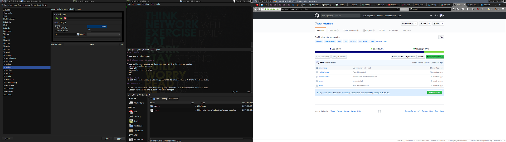

# My Dotfiles

These are my dotfiles. The main goal of this setup is to go completely mouseless while being usable for others. These files are here so that I can get my setup back after a reinstall. Feel free to get some inspiration, but please don't expect them to work for you. Others have done this much better, check out [awesome-dotfiles](https://github.com/webpro/awesome-dotfiles).

## How do I get the same dark look?
To get the dark look, I use lxappearance to change the GTK theme to Xfce-dusk. The Terminal is just black and white with a 10% transparency and Deja Vu Sans Mono at 10pt. Firefox also has a dark theme.

## Included configurations

These dotfiles include configurations for the following tools:
- awesome window manager
- redshift
- vimperator for firefox
- vim 
- zsh

## Dependencies

To work as intended, the following requirements and dependencies must be met:
- Debian with xfce and awesome window manager (worked best for me)
- scrot for screenshots
